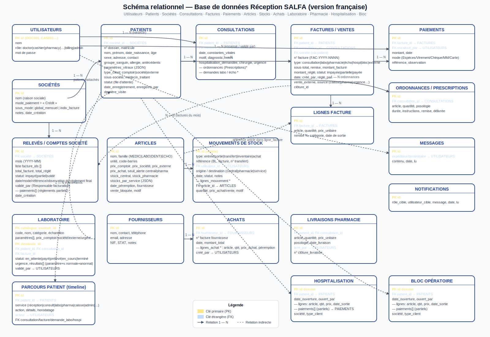

# Schéma de la base de données — Réception SALFA

Ce document décrit le modèle relationnel utilisé par l'application **Réception SALFA** (HIS — Hospital Information System).
Le diagramme d'accompagnement se trouve dans le fichier [`schema-base-donnees.svg`](./schema-base-donnees.svg).



---

## 🎯 Principes généraux

- **Zéro perte de données patient** : le retrait d'un patient d'une file d'attente (réception, médecin, caisse) ne supprime jamais son dossier, ni ses paramètres vitaux, ni ses consultations/paiements déjà réglés. Seules les données du passage en cours *non encaissées* sont annulées.
- **Modes de paiement de l'hôpital** : uniquement `Espèces` (comptoir / individuels) et `Crédit` (sociétés conventionnées). Aucune société ne peut être réglée en espèces.
- **Sous-modes de règlement société** :
  - `global mensuel` : toutes les factures d'un mois sont regroupées sur un relevé et réglées en une fois ;
  - `individuel par facture` : chaque facture peut être réglée indépendamment, y compris partiellement.
- **Responsable facturation** (`billing`) : rôle dédié au règlement des comptes sociétés, séparé de la Caisse.

---

## 🧑‍⚕️ Entités principales

| Entité | Description |
|--------|-------------|
| **Utilisateurs** | Comptes du personnel : `doctor`, `cashier`, `pharmacy`, `magasinier`, `laboratory`, `billing`, `admin`. |
| **Patients** | Dossiers patients (n° dossier, identité, groupe sanguin, allergies, constantes, type de client, société rattachée…). |
| **Sociétés** | Entreprises conventionnées — systématiquement en `Crédit`, avec un sous-mode `global_mensuel` ou `individuel par facture`. |

## 🩺 Parcours de soins

| Entité | Description |
|--------|-------------|
| **Consultations** | Actes médicaux : motif, diagnostic, notes, constantes, prescriptions, demandes labo/écho, hospitalisation, chirurgie. |
| **Ordonnances / Prescriptions** | Lignes de médicaments prescrites par le médecin (article, famille article, quantité, posologie, durée, remise, délivrée oui/non, date de délivrance/sortie). |
| **Laboratoire** | Catalogue d'examens (`LabExamCatalog`) + demandes d'analyses (`LabRequest`) avec résultat, urgence, prélèvement, validation. |
| **Échographies** | Demandes d'échographie liées aux consultations. |
| **Hospitalisation** | Dossiers d'hospitalisation avec lignes d'actes/prescriptions, famille article, date de sortie et paiements partiels. |
| **Bloc opératoire** | Dossiers chirurgicaux, même structure que l'hospitalisation et mêmes informations de ligne que les prescriptions. |
| **Parcours patient** | Journal (timeline) des événements par patient : admission, consultation, paiement, délivrance médicaments, résultat labo, etc. |

## 💰 Facturation & règlements

| Entité | Description |
|--------|-------------|
| **Factures / Ventes** | Toutes les prestations facturées : consultations, pharmacie, labo, écho, hospit, bloc, externes. Statut : `impayée`, `partiellement payée`, `payée`, `annulée`. |
| **Lignes facture / venteLines** | Détail ligne par ligne (article, famille, quantité, prix unitaire, remise, catégorie, lien prescription/Hospit-Bloc, date de sortie). |
| **Paiements** | Encaissements liés à une facture : montant, date, mode, référence, encaissé par. |
| **Relevés / Comptes société** | Regroupement mensuel des factures d'une société (pour le sous-mode *global mensuel*) avec les paiements associés (acompte, solde, virement, chèque…). Le relevé passe au statut `soldé` lorsque le solde est nul. |

## 📦 Stocks, articles et achats

| Entité | Description |
|--------|-------------|
| **Articles** | Catalogue de médicaments, consommables labo, dentaire, écho, etc. La famille est un code dynamique issu de `familles`; prix par type de client, stock central/pharmacie/services, seuil d'alerte, fournisseur, péremption. |
| **Mouvements de stock** | Entête + lignes pour toutes les entrées, sorties, transferts et inventaires (dépôts : central, pharmacie, services). |
| **Fournisseurs** | Coordonnées, NIF, STAT, contact. |
| **Achats** | Commandes/livraisons auprès d'un fournisseur, avec lignes d'articles (quantités, prix d'achat, dates de péremption). |
| **Livraisons pharmacie** | Livraisons de médicaments aux patients (délivrances ordonnances / ventes), rattachées à la clôture de garde. |

## 📬 Messagerie & journal

| Entité | Description |
|--------|-------------|
| **Messages** | Messagerie interne entre utilisateurs (expéditeur, destinataire, contenu, lu/non lu). |
| **Notifications** | Notifications par rôle / utilisateur (ex : « Analyse à valider », « Stock bas »). |
| **Journal d'audit** | Traçabilité complète des actions système (création/modification/suppression, horodatage, utilisateur). |

---

## 🔗 Relations clés

```
Utilisateurs (1) ──< (N) Consultations           (médecin traitant)
Utilisateurs (1) ──< (N) Paiements              (caissier / resp. facturation)
Utilisateurs (1) ──< (N) Mouvements de stock     (magasinier / pharmacie)
Sociétés     (1) ──< (N) Patients                (salariés rattachés)
Patients     (1) ──< (N) Consultations
Patients     (1) ──< (N) Factures
Consultations(1) ──< (N) Prescriptions
Consultations(1) ──< (N) Demandes labo / écho
Prescriptions(1) ──< (0..1) venteLines        (prescriptionId)
Factures     (1) ──< (N) Lignes facture
Factures     (1) ──< (N) Paiements
Sociétés     (1) ──< (N) Relevés mensuels
Relevés      (1) ──< (N) Paiements              (acompte + solde)
Relevés      (M) ──< (N) Factures               (via invoiceIds[])
Articles     (1) ──< (N) Lignes de mouvement
Articles     (1) ──< (N) Lignes d'achat / de vente
Familles     (1) ──< (N) Articles / Prescriptions / venteLines (via code famille)
HbRecord     (1) ──< (N) HbLine ──< (0..1) venteLines (hbLineId)
Fournisseurs (1) ──< (N) Achats
Patients     (1) ──< (N) Parcours (timeline)
Utilisateurs (1) ──< (N) Messages (expéditeur & destinataire)
```

---

## 🔒 Règles métier importantes

1. **Un patient société ne peut jamais être payé en espèces en caisse.** Ses factures partent automatiquement en Crédit et sont gérées par le *Responsable facturation*.
2. **Retrait d'une file d'attente ≠ suppression du dossier.** Seules les données du passage en cours non réglées sont annulées.
3. **Annulation** : seules les consultations, demandes (labo/écho) et factures non réglées peuvent être annulées.
4. **Le relevé mensuel** ne peut être soldé qu'après saisie du montant, de la date, du mode de paiement, de la référence et de l'observation ; le responsable facturation qui valide est enregistré.
5. **Paiements partiels** supportés sur les factures *individuelles société* et les dossiers hospitalisation/bloc.
6. **Familles dynamiques** : `Article.family` est un code `string` provenant de `familles`; ce code est reporté dans les prescriptions, HbLine et venteLines.
7. **Date de sortie prescription** : pour les ordonnances, `venteLines.dateSort` n'est pas saisie à l'encaissement ; elle prend la date de délivrance pharmacie (`deliveredAt` → `YYYY-MM-DD`).
8. **Le dossier patient**, ses paramètres vitaux et l'historique réglé sont **toujours conservés**.

---

## Jeu de démonstration massif et facturation crédit

L'état de démonstration est construit par `src/data/massiveDemoData.ts`. Il ne contient aucune identité réelle : un générateur pseudo-aléatoire à graine fixe (`0x51af1a`) fabrique des identifiants, dossiers, matricules, contacts et adresses synthétiques. Les identifiants, dates et relations sont donc reproductibles à chaque restauration de la démo.

Le générateur couvre 24 mois (du 21 juillet 2024 au 21 juillet 2026) et produit notamment 3 000 patients aux couples nom/prénom uniques, 4 500 consultations, factures et ventes, plus de 9 000 lignes de ventes, des paiements, demandes/résultats de laboratoire, délivrances, achats/entrées et mouvements. Les listes doivent être filtrées ou paginées par les écrans avant rendu complet.

### Relations crédit société

```text
companies (paymentMode = Crédit, settlementMode)
  1 ─── N patients (patient.company)
  1 ─── N invoices / ventes (company)
  1 ─── N companyBillingAccounts (company, month)
companyBillingAccounts.invoiceIds ─── N invoices
companyBillingAccounts.payments ─── N règlements de relevé
ventePayments.venteId ─── 1 ventes
venteLines.venteId ─── 1 ventes
```

- `monthly_global` : les factures du mois sont regroupées dans `companyBillingAccounts`; les règlements sont portés par `CompanyBillingPayment`.
- `per_invoice` : la facture/vente est réglée individuellement, éventuellement avec plusieurs `ventePayments`.
- Les données de démonstration sont uniquement le retour de `createInitialState`; elles ne constituent pas une commande de suppression des données saisies.
